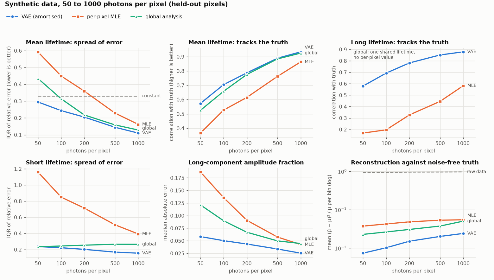
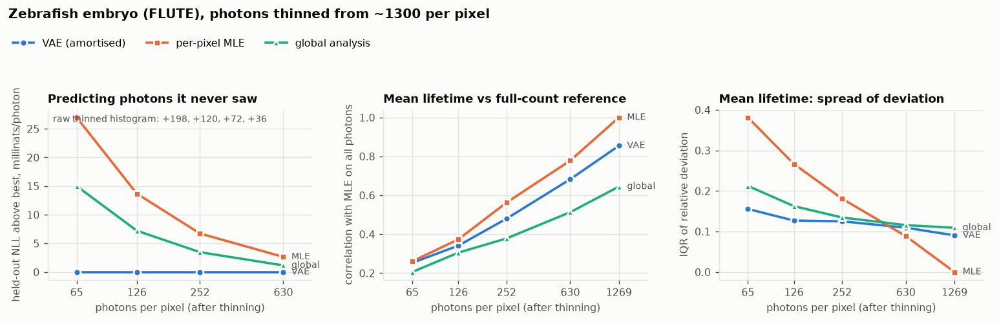
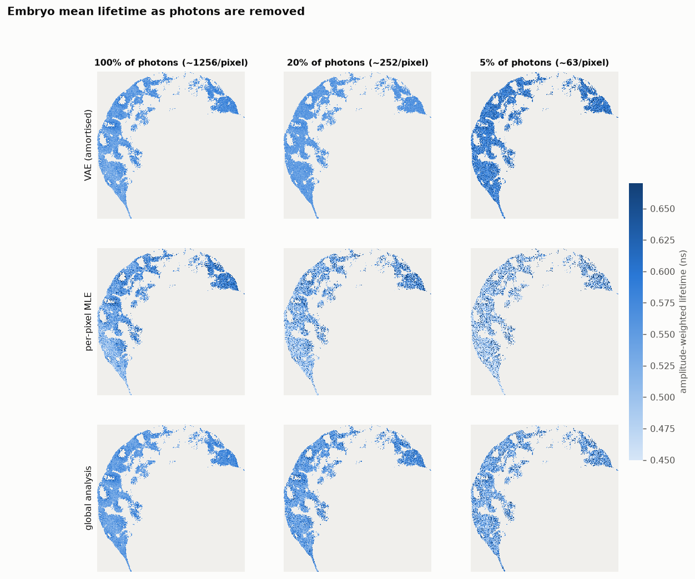
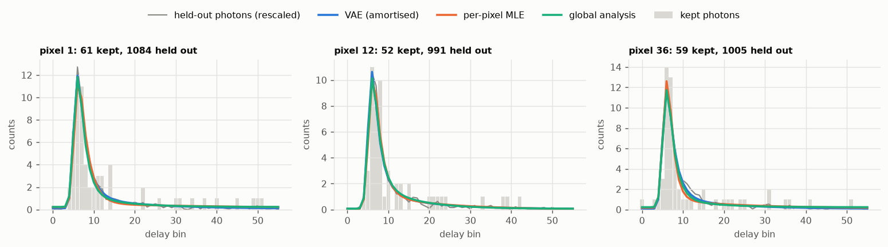

# LUMOS-FLIM

The LUMOS physics-informed VAE, adapted from photobleaching Raman to
time-correlated single photon counting (TCSPC) fluorescence lifetime imaging.
As in LUMOS, the network does not reconstruct the signal. It predicts the
parameters of an analytical forward model (per-pixel lifetimes, photon
fractions and a constant background), and the model produces the histogram.
Training is unsupervised and uses the exact Poisson likelihood of photon
counting.

## Why FLIM

Of the candidates (FLIM, NMR T2 relaxometry, DOSY), FLIM is the closest match
to LUMOS and the easiest to get real data for:

| LUMOS (photobleaching) | FLIM (TCSPC) |
|---|---|
| static Raman spectrum, constant in time | uncorrelated background (dark counts, ambient light), constant in delay |
| fluorophores bleaching at per-sample rates | fluorophores decaying at per-pixel lifetimes |
| CCD integrates each frame: `(1 - e^(-λT))/λ` | TCSPC integrates each delay bin, the same factor |
| decoder emits effective amplitudes | decoder emits photon fractions |
| instrument blur, a learnable Gaussian | instrument response (IRF), a learnable Gaussian |
| global fluorophore bases `B_i(ν)` | global emission spectra per detection channel (spectral FLIM) |

It also adds physics LUMOS did not need: excitation is periodic, so decay left
over from earlier laser pulses wraps into the window. That shows up in real
data as counts before the rising edge that match the tail. The noise model is
exact rather than learned, because every count is a photon.

NMR T2 would also work, but a CPMG decay has no second axis (the spectral
dimension that makes LUMOS a matrix problem). Clean multi-echo data also means
stimulated-echo corrections (EPG), and public data for it is harder to get
hold of.

## The physics

For pixel `p` the expected count in delay bin `n` (width `D`, period `P = N D`) is

    h_n = n_p * [ f_bg / N + sum_i f_i * p_i(n) ]

- `n_p` is the pixel's photon total. The model is conditioned on it, so the
  likelihood is multinomial and the overall scale is not a free parameter.
- `f_i` and `f_bg` are the photon fractions of each lifetime component and of
  the background. They sum to one.
- `p_i(n)` is the probability that a photon of lifetime `1/k_i` lands in bin
  `n`. The photon arrives `t0 + N(0, σ²) + Exp(k_i)` after its pulse, summed
  over all earlier pulses and integrated over the bin. With a Gaussian IRF this
  has a closed form (a periodic, bin-integrated exponentially modified
  Gaussian), evaluated exactly and stably in `physics.py`. It is not
  discretised and convolved on a grid.

Lifetimes are built as a cumulative sum of rates, so component 0 always has
the longest lifetime and labels cannot swap between pixels. The slowest rate
is bounded below by one period, because a much longer lifetime is flat and
indistinguishable from background (the same degeneracy LUMOS has between slow
bleaching and the static Raman). Photon fractions convert to the amplitude
fractions usually quoted (free and bound NADH, say) via `a_i ∝ f_i k_i`.

The loss is `sum_n h_n log(h_n / μ_n)` per pixel plus the KL term. That is the
exact negative log-likelihood less its saturated value, and half the Poisson
deviance. A reduced chi-square near 1 therefore means the physics and the noise
model both fit, which is a stronger check than LUMOS could make with its learned
noise.

## Data

Real data comes from the FLUTE dataset (Gottlieb et al. 2023, Zenodo
[8046636](https://doi.org/10.5281/zenodo.8046636), CC BY 4.0), mirrored in
[phasorpy-data](https://github.com/phasorpy/phasorpy-data/tree/main/zenodo_8046636).
It has NADH autofluorescence of human mesenchymal stem cells, control and
rotenone-treated, plus a zebrafish embryo, each with a fluorescein reference.
It is ImSpector OME-TIFF, 56 bins over one 12.48 ns period (80.11 MHz).

```bash
pip install -e ".[test]"
git clone --depth 1 https://github.com/phasorpy/phasorpy-data   # ~2 GB, only zenodo_8046636 is needed
D=phasorpy-data/zenodo_8046636

# pixels -> store (2x2 binning, drop pixels under 500 photons)
python -m lumos_flim.prepare "$D/hMSC control.tif" "$D/hMSC_rotenone.tif" --out data/hmsc.zarr --bin 2 --min_counts 500

# IRF from the fluorescein reference
python -m lumos_flim.calibrate "$D/Fluorescein_hMSC.tif" --tau 4.2 --out calibration/irf_hmsc.json

python -m lumos_flim.train --data data/hmsc.zarr --irf calibration/irf_hmsc.json --irf_fit free
python -m lumos_flim.predict checkpoints/<run>/best.ckpt --data data/hmsc.zarr --out results/hmsc --n_samples 10
```

Training runs on PyTorch Lightning and picks the hardware itself: CUDA if
present, then Apple MPS, then CPU (`--accelerator auto`; pass `cuda`, `mps` or
`cpu` to choose). On a GPU the whole pixel store is copied to the device once
(`--preload`, on by default) and batches are gathered with a single indexing
call. `predict.py` and `baseline.py` take `--device` in the same way. The
normal CDF, its log and the scaled complementary error function are built
from elementary operations (Numerical Recipes' erfc fit, relative error below
1.2e-7), because MPS has no kernels for `torch.special.erfcx` or `log_ndtr`.
`tests/test_physics.py::test_runs_on_device` checks the physics and a training
step on every accelerator present against the CPU result. Calibration stays on
the CPU in float64. The GPU paths were written for CUDA and MPS but only the
CPU path has been run so far; run the tests on the target machine first.

Synthetic data with ground truth is simulated photon by photon. The generator
does not use the analytical model, so a fit is not the model agreeing with
itself:

```bash
python -m lumos_flim.synthetic --out data/synthetic.zarr --photons 1000
python -m lumos_flim.synthetic --out data/synthetic_spec.zarr --channels 8   # spectral FLIM
```

`baseline.py` fits every pixel independently by maximum likelihood with the
same physics, parametrisation and IRF, so the difference from the VAE is only
in how the per-pixel parameters are estimated.

## Results so far

These come from short CPU runs (60 epochs, default settings, one seed). They
show the approach works. They are not tuned numbers.

**Physics check.** The analytical histograms match Monte-Carlo photon
simulations (reduced chi-square about 1) for lifetimes from 1 ps to 30 ns,
including an IRF that straddles the end of the window. See
`tests/test_physics.py`.

**Direct fit, no network.** Before any amortisation, `baseline.py --fit_irf`
fits the physics model straight to the data. Per-pixel lifetimes and fractions
and one shared IRF are optimised jointly by maximum likelihood, starting from
the rising edge of the data:

```bash
python -m lumos_flim.baseline --data data/hmsc.zarr --fit_irf --out results/hmsc_direct
```

On synthetic data this recovers the IRF from scratch (t0 = 1.006 ns and
σ = 0.122 ns, against the true 1.0 and 0.12), with reduced chi-square 0.97.
On hMSC it reaches reduced chi-square 0.99, and its IRF (0.427 / 0.109 ns)
agrees with the one the VAE learned (0.423 / 0.107 ns). The residuals show no
structure, so the forward model alone describes the data before any network
is involved. Its lifetimes are in the hMSC table below as "MLE". Random pixels,
data against fit, with normalised residuals:


**Synthetic ground truth.** The VAE learns the IRF from scratch to
t0 = 1.00 ns and σ = 0.120 ns (the true values) with reduced chi-square 1.0.
Accuracy against the per-pixel fit and global analysis is in the evaluation
below. With 8 spectral channels (`--channels 8`), the two emission spectra
are recovered with the right shapes and lifetimes to about 8%.

**Fluorescein references.** A free single-exponential fit gives 3.99 ns for
the embryo reference (literature 4.0-4.2 ns). The hMSC reference gives
3.59 ns. Its raw tail slope is about 3.8 ns before the wrap-around correction,
so the dye there genuinely decays faster than 4.2 ns. Its residuals also
alternate by ±50σ bin to bin, which looks like timing nonlinearity in the
electronics. Holding τ at 4.2 ns for that reference therefore gives the wrong
IRF, which is why the hMSC run uses `--irf_fit free` and lets the model
refine the IRF.

**hMSC NADH, 2x2 binned, pixels over 500 photons** (medians per image):

| | τ bound (ns) | τ free (ns) | α free | amplitude-weighted τ (ns) | reduced χ² |
|---|---|---|---|---|---|
| control, VAE | 3.17 | 0.51 | 0.79 | 1.07 | 1.04 |
| control, MLE | 3.12 | 0.48 | 0.79 | 1.08 | 0.99 |
| rotenone, VAE | 2.90 | 0.46 | 0.81 | 0.93 | 1.04 |
| rotenone, MLE | 2.80 | 0.43 | 0.82 | 0.89 | 0.99 |

The lifetimes sit in the usual NADH ranges (free about 0.4 ns, bound 2-3.4
ns). Rotenone shortens the mean lifetime and raises the free fraction. The raw
phasor shows the same shift with no model at all: phase 43.3° to 40.4°,
modulation 0.58 to 0.61. VAE numbers are posterior medians over 20 draws;
decoding the posterior mean instead put the bound lifetime about 10% high
(see Inference below).


Caveat on the maps: the VAE's per-pixel spread of α is narrow (0.77-0.84
in the rotenone image, 2nd to 98th percentile; the per-pixel fit spans
0.67-0.91, including its own noise). Some of that is the prior pulling
pixels towards the population, so it is not evidence of uniform metabolism.

## Evaluation

Three methods, each fitted end to end with the IRF learned from the data (no
calibration file):

- **VAE**: the amortised model, β = 1 ELBO with a 20-epoch KL warm-up,
  per-pixel parameters as posterior medians over 20 draws.
- **Per-pixel MLE**: every pixel fitted independently by maximum likelihood
  (`baseline.py --fit_irf`).
- **Global analysis**: one set of lifetimes shared by every pixel, fractions
  and background per pixel (`baseline.py --fit_irf --global_lifetimes`). This
  is the usual remedy for low counts in FLIM.

One seed, 60 epochs, CPU. Scripts: `scripts/photon_sweep.py`,
`scripts/thinning_study.py`, `scripts/kl_study.py`, and
`scripts/plot_evaluation.py` for the figures.

### Inference: decode samples, not the mean

Decoding the posterior mean of the latent put the long lifetime 22% high and
tripled the α error (0.149 against 0.046 at 200 photons, same checkpoint).
The decoder is nonlinear and the posterior is wide, so the decoded mean is
not the posterior's view of the parameters. Taking the median of the
parameters over posterior draws, as lumos-vae's `sample_posterior` does,
removes the bias. It is now the default in `predict.py`. Every VAE number in
earlier versions of this README that showed a 7-25% lifetime bias came from
mean decoding.

### KL: β = 1 is right

The model uses only one or two of its 16 latent dimensions. To test whether
that is the β = 1 optimum or an optimisation failure, the same data was fitted
with the plain ELBO, with KL warm-up (which ends at β = 1, so the objective is
unchanged), and with free bits (which changes the objective by exempting the
first few nats per dimension from the KL):

| photons | objective | −ELBO (val) | KL (nats) | active dims | τ long bias / IQR | τ_amp IQR | α MAE |
|---|---|---|---|---|---|---|---|
| 200 | beta1 | 29.80 | 0.86 | 1 | -0.004 / 0.085 | 0.219 | 0.046 |
| 200 | warmup20 | 29.77 | 0.95 | 2 | -0.005 / 0.082 | 0.205 | 0.046 |
| 200 | freebits0.25 | 31.74 | 3.70 | 16 | -0.020 / 0.138 | 0.218 | 0.056 |
| 200 | freebits1 | 37.98 | 9.69 | 16 | +0.076 / 0.160 | 0.241 | 0.065 |
| 1000 | beta1 | 31.30 | 2.06 | 2 | -0.008 / 0.064 | 0.110 | 0.026 |
| 1000 | warmup20 | 31.21 | 2.06 | 2 | -0.002 / 0.066 | 0.109 | 0.026 |
| 1000 | freebits0.25 | 33.31 | 4.76 | 16 | -0.006 / 0.077 | 0.115 | 0.029 |
| 1000 | freebits1 | 40.54 | 11.12 | 16 | +0.016 / 0.097 | 0.129 | 0.039 |

Warm-up gives a slightly better ELBO than plain training with the same
accuracy. Free bits uses all 16 dimensions and is worse on every count. So
the low latent usage is the correct β = 1 optimum: the data does not support
more per-pixel information, and forcing it in adds noise. With the exact
Poisson likelihood there is no reason to move β away from 1.

### Synthetic data, 50 to 1000 photons per pixel

Held-out pixels, scored against ground truth. Relative errors on the
amplitude-weighted mean lifetime τ_amp, r is the correlation with the truth,
α MAE is the error in the long component's amplitude fraction, and the
reconstruction error is the mean over bins of (μ̂ − μ)² / μ against the
noise-free histogram (raw counts score about 1).



| photons | method | τ_amp bias / IQR | τ_amp r | τ long r | τ short IQR | α MAE | reconstruction |
|---|---|---|---|---|---|---|---|
| 50 | VAE | +0.01 / 0.30 | 0.57 | 0.58 | 0.24 | 0.058 | 0.0074 |
| 50 | MLE | -0.27 / 0.59 | 0.37 | 0.17 | 1.16 | 0.187 | 0.0375 |
| 50 | global | -0.05 / 0.43 | 0.53 | — | 0.23 | 0.121 | 0.0228 |
| 50 | raw data | | | | | | 0.93 |
| 100 | VAE | +0.00 / 0.24 | 0.70 | 0.69 | 0.22 | 0.050 | 0.0102 |
| 100 | MLE | -0.20 / 0.45 | 0.53 | 0.20 | 0.85 | 0.136 | 0.0427 |
| 100 | global | -0.02 / 0.31 | 0.66 | — | 0.24 | 0.090 | 0.0264 |
| 100 | raw data | | | | | | 0.94 |
| 200 | VAE | -0.01 / 0.21 | 0.79 | 0.78 | 0.20 | 0.044 | 0.0152 |
| 200 | MLE | -0.16 / 0.36 | 0.62 | 0.33 | 0.71 | 0.091 | 0.0485 |
| 200 | global | -0.01 / 0.22 | 0.78 | — | 0.25 | 0.067 | 0.0307 |
| 200 | raw data | | | | | | 0.96 |
| 500 | VAE | -0.00 / 0.14 | 0.89 | 0.85 | 0.17 | 0.034 | 0.0202 |
| 500 | MLE | -0.08 / 0.23 | 0.76 | 0.45 | 0.51 | 0.057 | 0.0535 |
| 500 | global | +0.01 / 0.16 | 0.88 | — | 0.27 | 0.050 | 0.0376 |
| 500 | raw data | | | | | | 0.96 |
| 1000 | VAE | -0.00 / 0.11 | 0.93 | 0.88 | 0.16 | 0.025 | 0.0242 |
| 1000 | MLE | -0.04 / 0.16 | 0.86 | 0.58 | 0.39 | 0.042 | 0.0549 |
| 1000 | global | +0.01 / 0.13 | 0.92 | — | 0.27 | 0.045 | 0.0506 |
| 1000 | raw data | | | | | | 0.97 |

- The VAE is best or joint best on every measure at every photon count. The
  clearest gains are in α (0.058 against 0.121 for global analysis and 0.187
  for per-pixel MLE at 50 photons) and in the long lifetime, which only it can
  resolve per pixel at low counts (r = 0.58 at 50 photons against 0.17).
  Global analysis's short-lifetime IQR only looks competitive because it
  gives every pixel the same value, so its IQR is just the spread of the
  truth.
- Its mean lifetime is essentially unbiased at every level. Per-pixel MLE
  underestimates it by 27% at 50 photons.
- Global analysis is close to the VAE on mean lifetime from 200 photons up.
  Here the true lifetimes vary between pixels, which is exactly what global
  analysis assumes away, so this dataset favours the VAE on that point.
- Reconstructions from all three methods are 18 to 130 times closer to the
  truth than the raw counts. The VAE's are 2 to 5 times closer again.

### Real data at varying noise levels: zebrafish embryo

The embryo image from FLUTE (not used anywhere else here), 2x2 binned,
pixels with at least 1000 photons (9094 pixels, median 1256). Noise levels
are made by keeping each photon with probability f. Binomial thinning of a
Poisson process is exactly the data of an acquisition f times as long, so
nothing is simulated. The photons removed are an independent measurement of
the same pixel, which gives a score that needs no ground truth: the negative
log-likelihood of the held-out photons under each method's fitted histogram.
Mean lifetimes are compared against per-pixel MLE on all photons. That
reference shares both photons and estimator with the thinned MLE, so it
flatters MLE; the held-out-photon score is the unbiased comparison.



| photons | method | held-out NLL (nats/photon) | τ_amp deviation median / IQR | τ_amp r |
|---|---|---|---|---|
| 630 | VAE | 2.8493 | +0.007 / 0.109 | 0.68 |
| 630 | global | 2.8504 | +0.007 / 0.116 | 0.51 |
| 630 | MLE | 2.8519 | -0.015 / 0.089 | 0.78 |
| 630 | raw data | 2.8851 | | |
| 252 | VAE | 2.8503 | +0.005 / 0.125 | 0.48 |
| 252 | global | 2.8537 | +0.008 / 0.134 | 0.38 |
| 252 | MLE | 2.8570 | -0.049 / 0.181 | 0.56 |
| 252 | raw data | 2.9221 | | |
| 126 | VAE | 2.8500 | +0.010 / 0.127 | 0.34 |
| 126 | global | 2.8573 | +0.005 / 0.163 | 0.30 |
| 126 | MLE | 2.8637 | -0.081 / 0.266 | 0.37 |
| 126 | raw data | 2.9696 | | |
| 65 | VAE | 2.8527 | +0.072 / 0.156 | 0.25 |
| 65 | global | 2.8677 | -0.024 / 0.212 | 0.21 |
| 65 | MLE | 2.8797 | -0.134 / 0.381 | 0.26 |
| 65 | raw data | 3.0504 | | |



- The VAE predicts unseen photons best at every noise level, and the margin
  grows as photons drop: 15 millinats per photon ahead of global analysis and
  27 ahead of per-pixel MLE at 65 photons. The raw thinned histogram is 36 to
  198 millinats per photon behind.
- Its mean lifetime has the smallest spread against the reference at 252
  photons and below.
- It keeps the tissue structure down to 65 photons per pixel, where per-pixel
  MLE has dissolved into speckle and drifted 13% short.
- But at 65 photons the VAE's map shifts about 7% long against the reference.
  It did not do this on synthetic data. Real tissue has a lifetime
  distribution the smooth synthetic maps do not, and at very low counts the
  model leans on what it learned from the population. The shift is visible in
  the right-hand column of the maps and should be kept in mind below about 100
  photons per pixel.

Example fits at 5% of the photons, with the held-out photons (rescaled) as an
independent check on the shape:



## A literal port of lumos-vae (removed)

An earlier variant copied lumos-vae with only the physics changed: global
std normalisation, unordered rates and the learned Gaussian noise model
`var = α·μ + β`. It did worst of the three methods at every photon level
(mean lifetime biased +30 to +50%, short lifetime off by +100 to +215%) and
has been removed. What it showed:

- The KL term of lumos-vae is sound. Dividing both reconstruction and KL by
  the element count keeps their ratio equal to the true ELBO, which is the
  same weighting this VAE uses per pixel.
- The learned noise model exists to find the right likelihood scale. For
  photon counting that scale is known exactly (in raw counts the variance
  equals the mean), so the Poisson likelihood is the model with the scale
  already fixed. In the port, α started 30 times too low and reached only
  0.03 of the correct 0.61 in 60 epochs, so the model fitted shot noise in
  bins holding 0 to 2 photons, where a Gaussian is a poor stand-in anyway.
- Its latent collapsed to one active dimension out of 64. Decoding the
  posterior mean then gave reconstructions four times worse than decoding
  samples, because the decoder had only seen samples. The same
  mean-versus-sample gap is worth checking in lumos-vae, whose `predict`
  decodes the mean when `n_predictions=1`.

## Layout

| Module | Role |
|---|---|
| `physics.py` | Exact periodic TCSPC forward model, amplitude/lifetime conversions, phasor |
| `vae.py` | Encoder (circular 1D CNN over delay), decoder, learnable IRF and spectra |
| `vae_module.py` | Lightning module: Poisson deviance + KL, chi-square and ground-truth logging |
| `data.py` | ImSpector TIFF reader, Zarr store, datamodule |
| `prepare.py` | TIFF images to pixel store |
| `synthetic.py` | Photon-level simulator with ground truth |
| `calibrate.py` | IRF from a reference dye of known lifetime |
| `train.py`, `predict.py` | Training and inference, maps and per-image summaries |
| `baseline.py` | Independent per-pixel MLE with the same physics, IRF optionally fitted |
| `scripts/photon_sweep.py` | Synthetic sweep against per-pixel MLE and global analysis |
| `scripts/thinning_study.py` | Real data at varying noise levels, scored on held-out photons |
| `scripts/kl_study.py` | β = 1 ELBO against KL warm-up and free bits |
| `scripts/plot_evaluation.py` | Evaluation figures |

Store layout: `counts [sample, channel, time]`, `split`, `image`, `y`, `x`,
and `gt_*` for synthetic data. Attributes: `bin_width_ns`, `period_ns`,
`image_names`, `image_shapes`.

## Limitations

- The IRF is Gaussian. Real detector IRFs have tails, and at 10^8 photons the
  reference fits show it (reduced chi-square far above 1). A measured IRF could
  be added as a discrete circular convolution, but none ships with FLUTE.
- One IRF for the whole image. On scanning systems `t0` can drift across the
  field. A per-pixel shift would be a small extension.
- No pile-up or dead-time correction. That is fine at the count rates in
  FLUTE, but not at high rates.
- Pixels are independent apart from sharing the encoder. Spatial binning is
  done up front, not learned.
