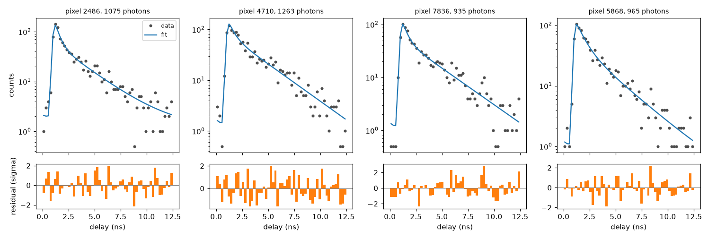
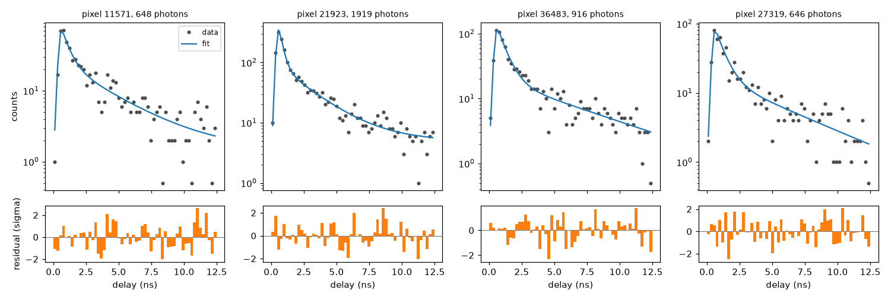
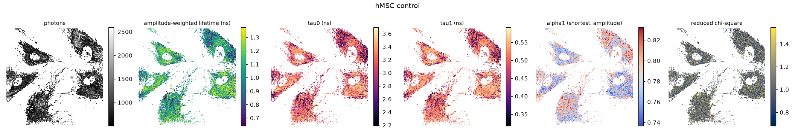
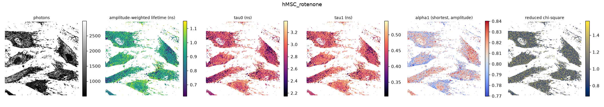

# LUMOS-FLIM

The LUMOS physics-informed VAE, adapted from photobleaching Raman to
time-correlated single photon counting (TCSPC) fluorescence lifetime imaging.
As in LUMOS, the network does not reconstruct the signal. It predicts the
parameters of an analytical forward model (per-pixel lifetimes, photon
fractions and a constant background), and the model produces the histogram.
Training is unsupervised and uses the exact Poisson likelihood of photon
counting.

## Why FLIM

Of the candidates (FLIM, NMR T2 relaxometry, DOSY), FLIM is the closest match
to LUMOS and the easiest to get real data for:

| LUMOS (photobleaching) | FLIM (TCSPC) |
|---|---|
| static Raman spectrum, constant in time | uncorrelated background (dark counts, ambient light), constant in delay |
| fluorophores bleaching at per-sample rates | fluorophores decaying at per-pixel lifetimes |
| CCD integrates each frame: `(1 - e^(-λT))/λ` | TCSPC integrates each delay bin, the same factor |
| decoder emits effective amplitudes | decoder emits photon fractions |
| instrument blur, a learnable Gaussian | instrument response (IRF), a learnable Gaussian |
| global fluorophore bases `B_i(ν)` | global emission spectra per detection channel (spectral FLIM) |

It also adds physics LUMOS did not need: excitation is periodic, so decay left
over from earlier laser pulses wraps into the window. That shows up in real
data as counts before the rising edge that match the tail. The noise model is
exact rather than learned, because every count is a photon.

NMR T2 would also work, but a CPMG decay has no second axis (the spectral
dimension that makes LUMOS a matrix problem). Clean multi-echo data also means
stimulated-echo corrections (EPG), and public data for it is harder to get
hold of.

## The physics

For pixel `p` the expected count in delay bin `n` (width `D`, period `P = N D`) is

    h_n = n_p * [ f_bg / N + sum_i f_i * p_i(n) ]

- `n_p` is the pixel's photon total. The model is conditioned on it, so the
  likelihood is multinomial and the overall scale is not a free parameter.
- `f_i` and `f_bg` are the photon fractions of each lifetime component and of
  the background. They sum to one.
- `p_i(n)` is the probability that a photon of lifetime `1/k_i` lands in bin
  `n`. The photon arrives `t0 + N(0, σ²) + Exp(k_i)` after its pulse, summed
  over all earlier pulses and integrated over the bin. With a Gaussian IRF this
  has a closed form (a periodic, bin-integrated exponentially modified
  Gaussian), evaluated exactly and stably in `physics.py`. It is not
  discretised and convolved on a grid.

Lifetimes are built as a cumulative sum of rates, so component 0 always has
the longest lifetime and labels cannot swap between pixels. The slowest rate
is bounded below by one period, because a much longer lifetime is flat and
indistinguishable from background (the same degeneracy LUMOS has between slow
bleaching and the static Raman). Photon fractions convert to the amplitude
fractions usually quoted (free and bound NADH, say) via `a_i ∝ f_i k_i`.

The loss is `sum_n h_n log(h_n / μ_n)` per pixel plus the KL term. That is the
exact negative log-likelihood less its saturated value, and half the Poisson
deviance. A reduced chi-square near 1 therefore means the physics and the noise
model both fit, which is a stronger check than LUMOS could make with its learned
noise.

## Data

Real data comes from the FLUTE dataset (Gottlieb et al. 2023, Zenodo
[8046636](https://doi.org/10.5281/zenodo.8046636), CC BY 4.0), mirrored in
[phasorpy-data](https://github.com/phasorpy/phasorpy-data/tree/main/zenodo_8046636).
It has NADH autofluorescence of human mesenchymal stem cells, control and
rotenone-treated, plus a zebrafish embryo, each with a fluorescein reference.
It is ImSpector OME-TIFF, 56 bins over one 12.48 ns period (80.11 MHz).

```bash
pip install -e ".[test]"
git clone --depth 1 https://github.com/phasorpy/phasorpy-data   # ~2 GB, only zenodo_8046636 is needed
D=phasorpy-data/zenodo_8046636

# pixels -> store (2x2 binning, drop pixels under 500 photons)
python -m lumos_flim.prepare "$D/hMSC control.tif" "$D/hMSC_rotenone.tif" --out data/hmsc.zarr --bin 2 --min_counts 500

# IRF from the fluorescein reference
python -m lumos_flim.calibrate "$D/Fluorescein_hMSC.tif" --tau 4.2 --out calibration/irf_hmsc.json

python -m lumos_flim.train --data data/hmsc.zarr --irf calibration/irf_hmsc.json --irf_fit free
python -m lumos_flim.predict checkpoints/<run>/best.ckpt --data data/hmsc.zarr --out results/hmsc --n_samples 10
```

Synthetic data with ground truth is simulated photon by photon. The generator
does not use the analytical model, so a fit is not the model agreeing with
itself:

```bash
python -m lumos_flim.synthetic --out data/synthetic.zarr --photons 1000
python -m lumos_flim.synthetic --out data/synthetic_spec.zarr --channels 8   # spectral FLIM
```

`baseline.py` fits every pixel independently by maximum likelihood with the
same physics, parametrisation and IRF, so the difference from the VAE is only
in how the per-pixel parameters are estimated.

## Results so far

These come from short CPU runs (60 epochs, default settings, one seed). They
show the approach works. They are not tuned numbers.

**Physics check.** The analytical histograms match Monte-Carlo photon
simulations (reduced chi-square about 1) for lifetimes from 1 ps to 30 ns,
including an IRF that straddles the end of the window. See
`tests/test_physics.py`.

**Direct fit, no network.** Before any amortisation, `baseline.py --fit_irf`
fits the physics model straight to the data. Per-pixel lifetimes and fractions
and one shared IRF are optimised jointly by maximum likelihood, starting from
the rising edge of the data:

```bash
python -m lumos_flim.baseline --data data/hmsc.zarr --fit_irf --out results/hmsc_direct
```

On synthetic data this recovers the IRF from scratch (t0 = 1.006 ns and
σ = 0.122 ns, against the true 1.0 and 0.12), with reduced chi-square 0.97.
On hMSC it reaches reduced chi-square 0.99, and its IRF (0.427 / 0.109 ns)
agrees with the one the VAE learned (0.423 / 0.107 ns). The residuals show no
structure, so the forward model alone describes the data before any network
is involved. Its lifetimes are in the hMSC table below as "MLE". Random pixels,
data against fit, with normalised residuals:




**Synthetic, 96x96, ~1000 photons/pixel, bi-exponential (τ 2-3.5 ns and
0.3-0.6 ns) plus background.** These are held-out pixels. The relative
lifetime errors are signed median / interquartile range, and α is the
amplitude fraction of the long component:

| | τ long | τ short | α long bias | background abs err |
|---|---|---|---|---|
| per-pixel MLE | -0.2% / 0.18 | -2.4% / 0.39 | -0.006 | 0.022 |
| VAE, `kl_weight=1` | +7.0% / 0.085 | +5.8% / 0.16 | -0.037 | 0.011 |
| VAE, `kl_weight=0.1` | +2.7% / 0.10 | +2.5% / 0.29 | -0.007 | 0.012 |

The VAE learns the IRF from scratch to t0 = 1.00 ns and σ = 0.120 ns (the true
values), and reaches a reduced chi-square of 1.0. It roughly halves the spread
of the per-pixel estimates, but at `kl_weight=1` the prior's shrinkage leaves
a bias of about 7% on the lifetimes. The KL weight trades between the two.
MLE is close to unbiased but noisy, as expected at this photon count. With 8
spectral channels (`--channels 8`), the two emission spectra are recovered
with the right shapes and lifetimes to about 8%.

**Fluorescein references.** A free single-exponential fit gives 3.99 ns for
the embryo reference (literature 4.0-4.2 ns). The hMSC reference gives
3.59 ns. Its raw tail slope is about 3.8 ns before the wrap-around correction,
so the dye there genuinely decays faster than 4.2 ns. Its residuals also
alternate by ±50σ bin to bin, which looks like timing nonlinearity in the
electronics. Holding τ at 4.2 ns for that reference therefore gives the wrong
IRF, which is why the hMSC run uses `--irf_fit free` and lets the model
refine the IRF.

**hMSC NADH, 2x2 binned, pixels over 500 photons** (medians per image):

| | τ bound (ns) | τ free (ns) | α free | amplitude-weighted τ (ns) | reduced χ² |
|---|---|---|---|---|---|
| control, VAE | 3.42 | 0.51 | 0.79 | 1.10 | 1.04 |
| control, MLE | 3.12 | 0.48 | 0.79 | 1.08 | 0.99 |
| rotenone, VAE | 3.08 | 0.48 | 0.81 | 0.96 | 1.04 |
| rotenone, MLE | 2.80 | 0.43 | 0.82 | 0.89 | 0.99 |

The lifetimes sit in the usual NADH ranges (free about 0.4 ns, bound 2-3.4
ns). Rotenone shortens the mean lifetime and raises the free fraction. The raw
phasor shows the same shift with no model at all: phase 43.3° to 40.4°,
modulation 0.58 to 0.61. The VAE's bound lifetime is about 10% above MLE's,
consistent with the synthetic bias at `kl_weight=1`.




Caveats on the maps. At `kl_weight=1` the per-pixel spread of α is narrow
(roughly 0.79-0.84 in the rotenone image), which is prior shrinkage and not
evidence of uniform metabolism. τ bound and τ free also dip together in some
cells. That could be biology, or the two lifetimes trading off, which a
bi-exponential at ~800 photons is prone to. Lower `kl_weight` or fitting
lifetimes globally with per-pixel fractions would help tell these apart.

## Low-photon sweep

`scripts/photon_sweep.py` simulates the same maps at 50 to 1000 photons per
pixel. At each level it fits the direct per-pixel MLE (`baseline.py
--fit_irf`) and the VAE, and scores the val pixels, which the VAE was not
fitted on. Lifetime biases and
IQRs are relative. α MAE is the absolute error in the long component's
amplitude fraction. τ_amp is the amplitude-weighted mean lifetime, the number
usually reported at low counts. The reconstruction error is the mean over bins
of (μ̂ − μ_true)² / μ_true against the noise-free histogram; the raw
measurement scores about 1 on it, so lower means denoised. One seed, 60
epochs, CPU.

| photons | method | τ long bias / IQR | τ short bias / IQR | α MAE | τ_amp bias / IQR | reconstruction error |
|---|---|---|---|---|---|---|
| 50 | raw data | | | | | 0.93 |
| 50 | MLE | -0.03 / 0.46 | -0.35 / 1.16 | 0.187 | -0.27 / 0.59 | 0.037 |
| 50 | VAE | +0.25 / 0.15 | -0.03 / 0.24 | 0.174 | -0.20 / 0.24 | 0.026 |
| 100 | raw data | | | | | 0.94 |
| 100 | MLE | -0.03 / 0.37 | -0.30 / 0.85 | 0.136 | -0.20 / 0.45 | 0.043 |
| 100 | VAE | +0.25 / 0.14 | -0.05 / 0.24 | 0.156 | -0.17 / 0.21 | 0.040 |
| 200 | raw data | | | | | 0.96 |
| 200 | MLE | -0.04 / 0.31 | -0.26 / 0.71 | 0.091 | -0.16 / 0.36 | 0.049 |
| 200 | VAE | +0.22 / 0.13 | -0.05 / 0.23 | 0.148 | -0.17 / 0.18 | 0.065 |
| 500 | raw data | | | | | 0.96 |
| 500 | MLE | -0.02 / 0.22 | -0.17 / 0.51 | 0.057 | -0.08 / 0.23 | 0.053 |
| 500 | VAE | +0.14 / 0.11 | +0.00 / 0.18 | 0.088 | -0.07 / 0.14 | 0.057 |
| 1000 | raw data | | | | | 0.97 |
| 1000 | MLE | -0.02 / 0.17 | -0.09 / 0.39 | 0.042 | -0.04 / 0.16 | 0.055 |
| 1000 | VAE | +0.07 / 0.08 | +0.05 / 0.16 | 0.042 | -0.01 / 0.10 | 0.036 |

What it shows:

- **Denoising.** The VAE and MLE reconstruct the histogram 15 to 35 times
  closer to the truth than the raw counts, because five
  parameters per pixel cannot follow shot noise. The VAE and MLE are
  comparable here (the VAE is ahead at 50, 100 and 1000 photons, behind at
  200 and 500). This comes from the physics, not from amortisation.
- **Mean lifetime.** τ_amp is where the VAE earns its keep. Its spread is 1.6
  to 2.5 times tighter than MLE's at every photon level, with similar or
  smaller bias. Both underestimate it by about 20% at 50 to 100 photons,
  which looks like a limit of the information in the data, not of either
  method.
- **Short lifetime.** MLE's short lifetime collapses at low counts (−35% bias,
  IQR 1.16 at 50 photons). The VAE's stays near unbiased with a fifth of the
  spread.
- **Long lifetime and α.** The VAE's long lifetime is biased high (+25% at
  50 to 100 photons, +7% at 1000), where MLE is unbiased but two to three times
  as spread. On α, MLE is better from 100 to 500 photons. Pooling across pixels
  pulls both quantities towards the population, which is the shrinkage cost.

How much of the VAE's tighter spread is information and how much is
shrinkage? Its latent carries only 0.4, 0.9 and 1.9 nats per pixel at 50,
200 and 1000 photons, in one or two active dimensions out of 16. Against a
predictor that outputs the population median for every pixel (held-out
pixels, r is the correlation with the truth):

| photons | long lifetime, VAE | long lifetime, constant | mean lifetime, VAE | mean lifetime, constant |
|---|---|---|---|---|
| 50 | IQR 0.15, r = 0.54 | IQR 0.15 | IQR 0.24, r = 0.57 | IQR 0.33 |
| 200 | IQR 0.13, r = 0.69 | IQR 0.15 | IQR 0.18, r = 0.78 | IQR 0.33 |
| 1000 | IQR 0.08, r = 0.83 | IQR 0.15 | IQR 0.10, r = 0.94 | IQR 0.33 |

The mean lifetime tracks the truth at every level. At 50 photons the long
lifetime does not: its spread equals the constant's, which is the VAE
falling back on the population value. MLE (IQR 0.46) does worse than the
constant there. The ELBO is correctly scaled, so this collapse is mostly the
data being uninformative (a bi-exponential can trade a long lifetime against
its fraction at almost no cost in likelihood), but 1.9 nats at 1000 photons
is probably short of what the data supports.

Extrapolation is not used in the FLIM setting. TCSPC records every delay bin
in parallel, so late bins cost nothing extra; what is scarce is photons.
Fitting early bins and extrapolating the tail, which pays off in LUMOS where
late frames cost time and bleaching, has no counterpart here, and all
methods use the full period.

## A literal port of lumos-vae (removed)

An earlier variant copied lumos-vae with only the physics changed: global
std normalisation, unordered rates and the learned Gaussian noise model
`var = α·μ + β`. It did worst of the three methods at every photon level
(mean lifetime biased +30 to +50%, short lifetime off by +100 to +215%) and
has been removed. What it showed:

- The KL term of lumos-vae is sound. Dividing both reconstruction and KL by
  the element count keeps their ratio equal to the true ELBO, which is the
  same weighting this VAE uses per pixel.
- The learned noise model exists to find the right likelihood scale. For
  photon counting that scale is known exactly (in raw counts the variance
  equals the mean), so the Poisson likelihood is the model with the scale
  already fixed. In the port, α started 30 times too low and reached only
  0.03 of the correct 0.61 in 60 epochs, so the model fitted shot noise in
  bins holding 0 to 2 photons, where a Gaussian is a poor stand-in anyway.
- Its latent collapsed to one active dimension out of 64. Decoding the
  posterior mean then gave reconstructions four times worse than decoding
  samples, because the decoder had only seen samples. The same
  mean-versus-sample gap is worth checking in lumos-vae, whose `predict`
  decodes the mean when `n_predictions=1`.

## Layout

| Module | Role |
|---|---|
| `physics.py` | Exact periodic TCSPC forward model, amplitude/lifetime conversions, phasor |
| `vae.py` | Encoder (circular 1D CNN over delay), decoder, learnable IRF and spectra |
| `vae_module.py` | Lightning module: Poisson deviance + KL, chi-square and ground-truth logging |
| `data.py` | ImSpector TIFF reader, Zarr store, datamodule |
| `prepare.py` | TIFF images to pixel store |
| `synthetic.py` | Photon-level simulator with ground truth |
| `calibrate.py` | IRF from a reference dye of known lifetime |
| `train.py`, `predict.py` | Training and inference, maps and per-image summaries |
| `baseline.py` | Independent per-pixel MLE with the same physics, IRF optionally fitted |
| `scripts/photon_sweep.py` | Low-photon comparison against the direct MLE fit |

Store layout: `counts [sample, channel, time]`, `split`, `image`, `y`, `x`,
and `gt_*` for synthetic data. Attributes: `bin_width_ns`, `period_ns`,
`image_names`, `image_shapes`.

## Limitations

- The IRF is Gaussian. Real detector IRFs have tails, and at 10^8 photons the
  reference fits show it (reduced chi-square far above 1). A measured IRF could
  be added as a discrete circular convolution, but none ships with FLUTE.
- One IRF for the whole image. On scanning systems `t0` can drift across the
  field. A per-pixel shift would be a small extension.
- No pile-up or dead-time correction. That is fine at the count rates in
  FLUTE, but not at high rates.
- Pixels are independent apart from sharing the encoder. Spatial binning is
  done up front, not learned.
